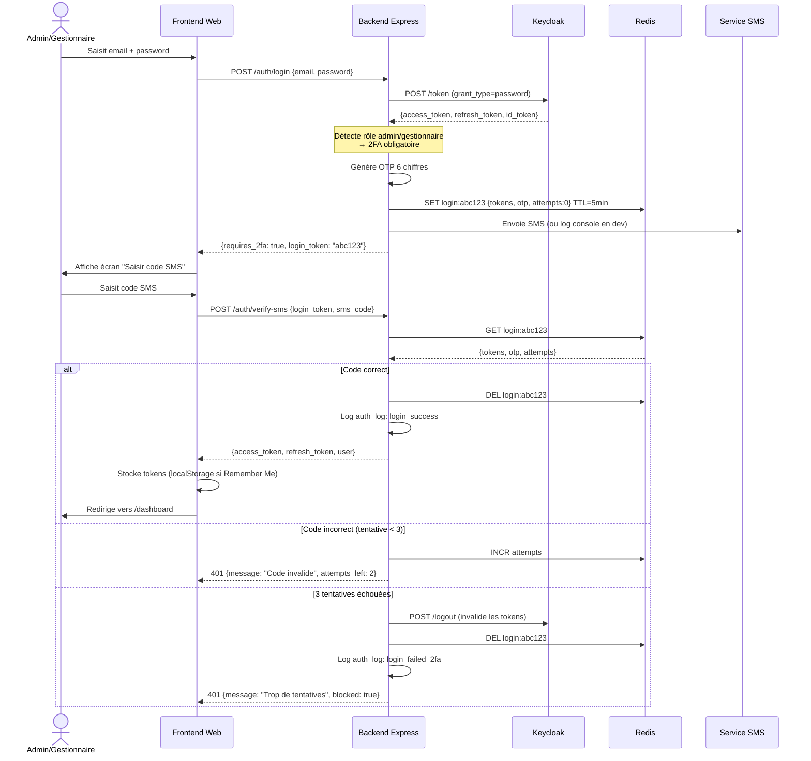
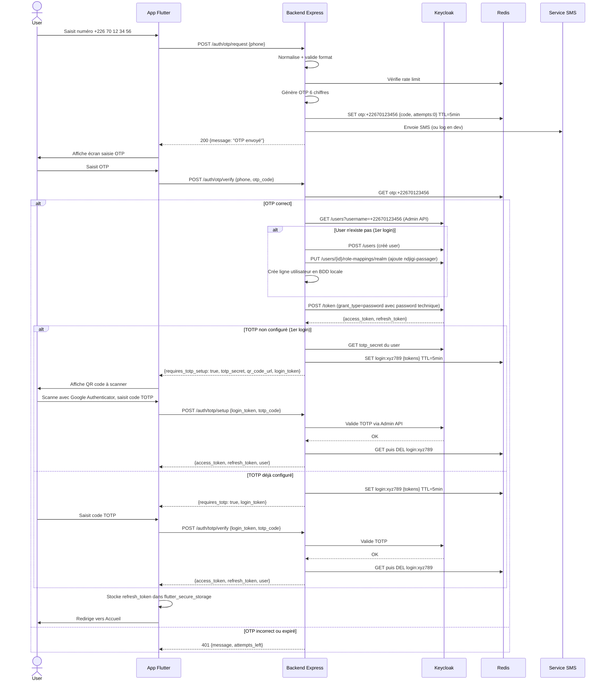
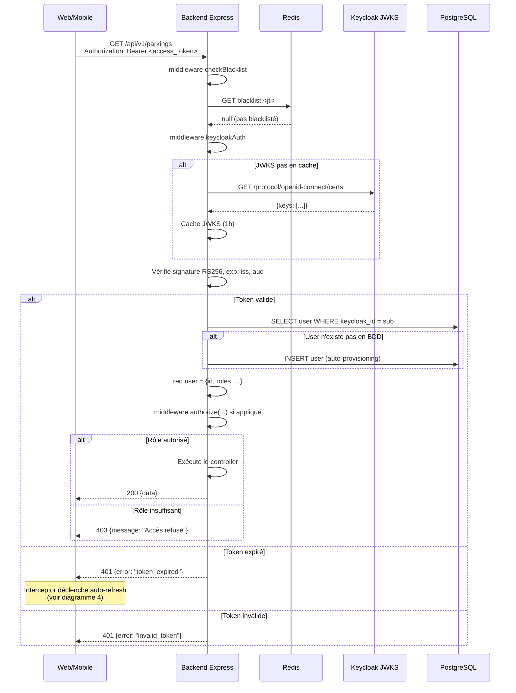
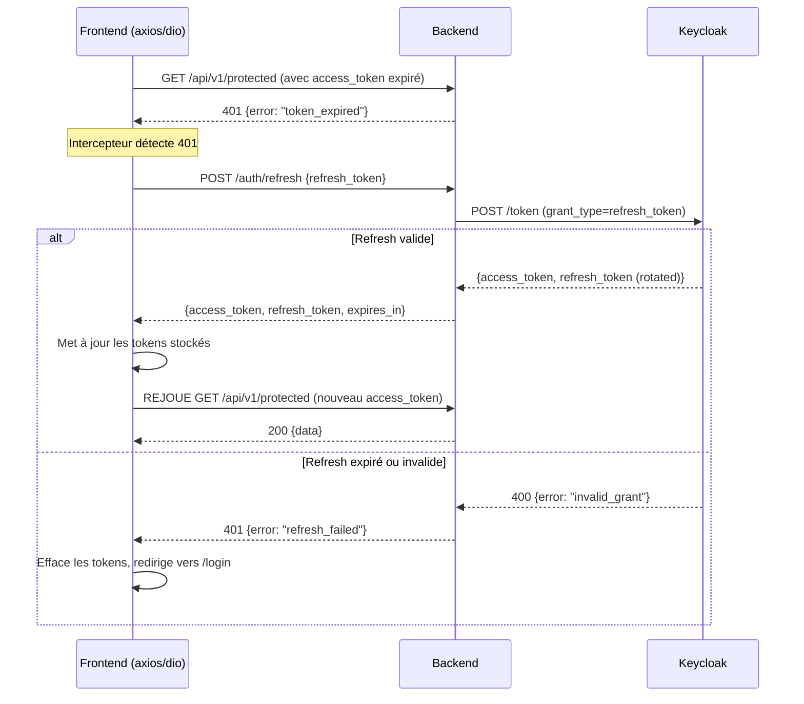
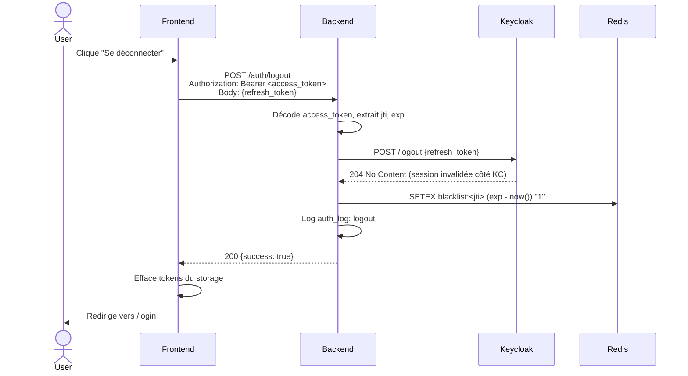
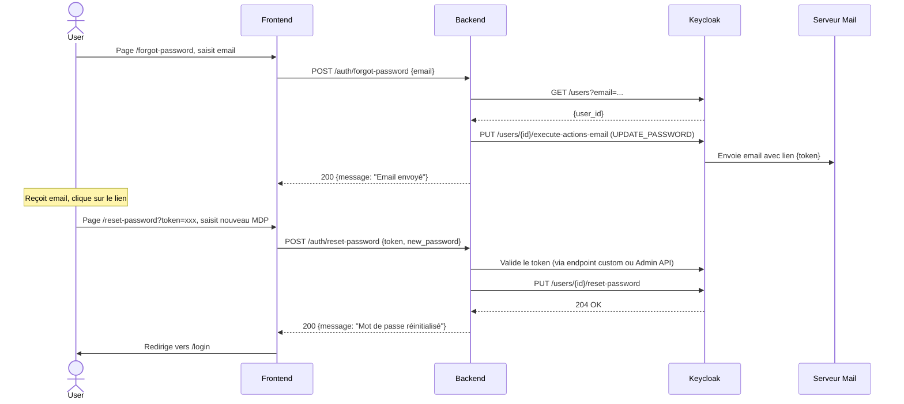
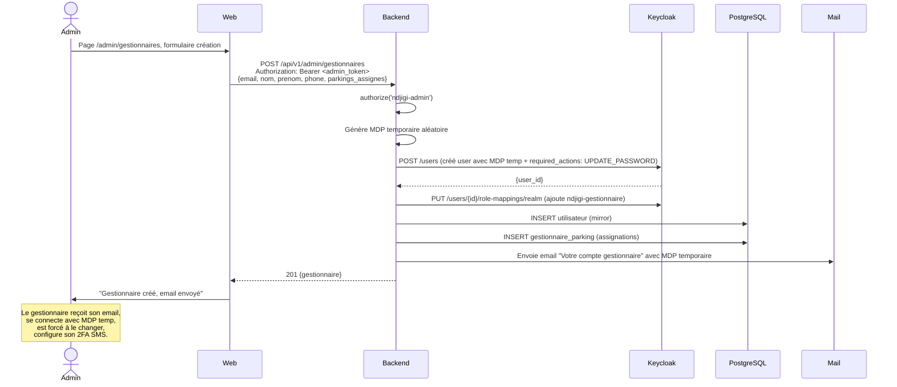

# Diagrammes de séquence des flows d'authentification

Tous les diagrammes sont en syntaxe Mermaid et peuvent être visualisés directement sur GitHub/GitLab/VSCode (avec l'extension Mermaid Preview).

---

## 1. Login admin/gestionnaire avec 2FA SMS

---

## 2. Login passager/chauffeur/propriétaire avec OTP SMS + TOTP

---

## 3. Appel API authentifié (n'importe quel rôle)

---

## 4. Refresh automatique du token (intercepteur frontend)

---

## 5. Logout

---

## 6. Reset password (admin/gestionnaire)

---

## 7. Création d'un gestionnaire par un admin

